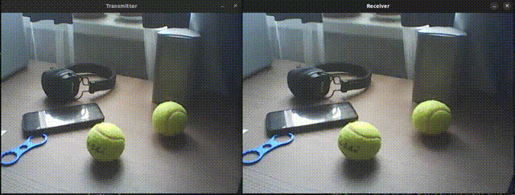

# udp_streamer
A library for transmitting video over UDP with minimal delays. The [OpenCV](https://opencv.org/) library is used to capture and encode images. This project is inspired by [udp-image-streaming](https://github.com/chenxiaoqino/udp-image-streaming/tree/master).



### Demo
The "demo" folder contains examples of receiver and transmitter code. Build and run the demo:

``` bash
mkdir build
cd build
cmake -DDemo:=ON ..
cmake --build .
cd Demo
# First terminal
.\udp_transmitter
# second terminal
.\udp_receiver
```

### Examples

``` c++
// udp_transmitter
#include "opencv2/opencv.hpp"
#include "udp_streamer/udp_streamer.hpp"

int main()
{
    // Preparing a udp client
    udp_streamer::Transmitter transmitter;
    transmitter.set_socket("127.0.0.1", 8000);
    transmitter.set_pack_size(4096);    // default
    transmitter.set_size(720, 480);     // default
    transmitter.set_interval(0);        // default
    transmitter.set_encode_quality(70); // default

    cv::VideoCapture cap(0);
    cv::namedWindow("Transmitter", cv::WINDOW_AUTOSIZE);
    cv::Mat original_img;

    while (true)
    {
        cap.read(original_img)

        cv::imshow("Transmitter", original_img);

        // Send a image
        transmitter.send_img(original_img);

        if (cv::waitKey(1) == (int)'q') break;
    }

    return 0;
}
```

``` c++
// udp_receiver
#include "opencv2/opencv.hpp"
#include "udp_streamer/udp_streamer.hpp"

int main()
{
    // Preparing a udp server
    udp_streamer::Receiver receiver;
    receiver.set_socket("127.0.0.1", 8000);
    receiver.socket_bind();
    receiver.set_timeout(1); // default

    cv::namedWindow("Receiver", cv::WINDOW_AUTOSIZE);

    cv::Mat output_img;

    while (true)
    {
        // Getting the image
        receiver.receive_img(output_img);

        cv::imshow("Receiver", output_img);

        if (cv::waitKey(1) == (int)'q') break;
    }

    return 0;
}

```